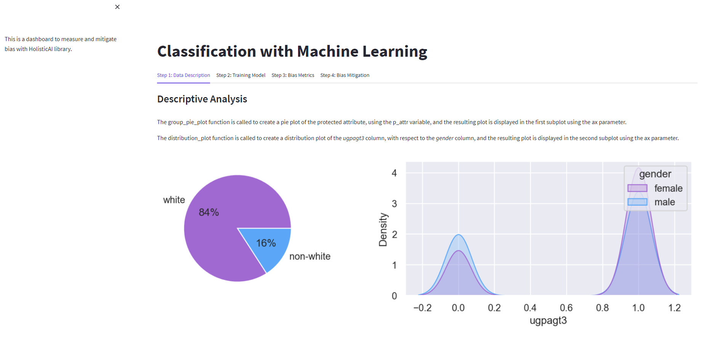

# Build your own Bias Measure and Mitigation App

In this repo we will build a bias measure and mitigation dashboard app in Python using the libraries holisticai, sklearn, and streamlit. To achieve this goal we need just five steps.

- [HolisticAI Library to Measure and Mitigate Bias](https://www.holisticai.com/open-source)
- [Measuring and Mitigating Bias: Introducing Holistic AI's Open-Source Library](https://www.holisticai.com/blog/measuring-and-mitigating-bias-using-holistic-ai-library)
 
